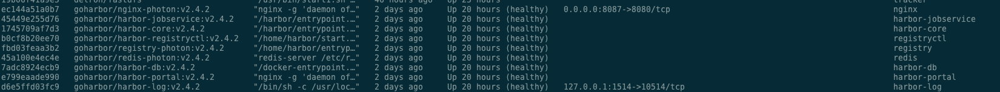

# docker部署harbor

默认情况下，Harbor运行起来后有如下容器：



### **安装docker-compose**

github镜像

```
curl -L https://github.com/docker/compose/releases/download/1.25.4/docker-compose-`uname -s`-`uname -m` -o /usr/local/bin/docker-compose
```

国内镜像（这个比较快）

```
curl -L https://get.daocloud.io/docker/compose/releases/download/1.25.0/docker-compose-`uname -s`-`uname -m` > /usr/local/bin/docker-compose

```

安装完之后授权

```
sudo chmod +x /usr/local/bin/docker-compose
```

查看是否安装成功

```
docker-compose --version
```

### **下载harbor安装包**

下载地址：[https://github.com/goharbor/harbor/releases](https://github.com/goharbor/harbor/releases)

这里我下载了最新的：harbor-offline-installer-v2.3.2.tgz。

**解压harbor**

```
tar xf harbor-offline-installer-v2.3.2.tgz
```

### **修改harbor安装的配置文件**

先复制出来配置文件

```
cp harbor.yml.tmpl  harbor.yml
```

主要修改点为：

* hostname: 192.168.6.59，改为本地的ip否则会报错：ERROR:root:Please specify hostname
* 注释掉https相关，否则报错：The protocol is https but attribute ssl\_cert is not set
* 修改端口 port: 100，原因是80端口和nas系统管理页面冲突,会导致nginx启动失败。
* 如果需要可以修改 data\_volume字段值，修改挂载目录。

**启动harbor**

cd 到 harbor执行

```
./install.sh
```

等待运行成功，即可启动harbor。

访问地址：[http://192.168.6.59:100/](http://192.168.6.59:100)

### 登入仓库

```
cat /etc/docker/daemon.json
{
  "registry-mirrors": ["https://sdfa.mirror.aliyuncs.com"],
  "insecure-registries":["192.168.6.59:100"],
  "live-restore": true
}

docker login -u admin -p asdfsdf 192.168.6.59:100

# 给镜像打tag 并且再推送到仓库
docker tag pilot-gateway:latest 192.168.6.59:100/pilot/pilot-gateway:latest
docker push 192.168.6.59:100/pilot/pilot-gateway:latest
```
